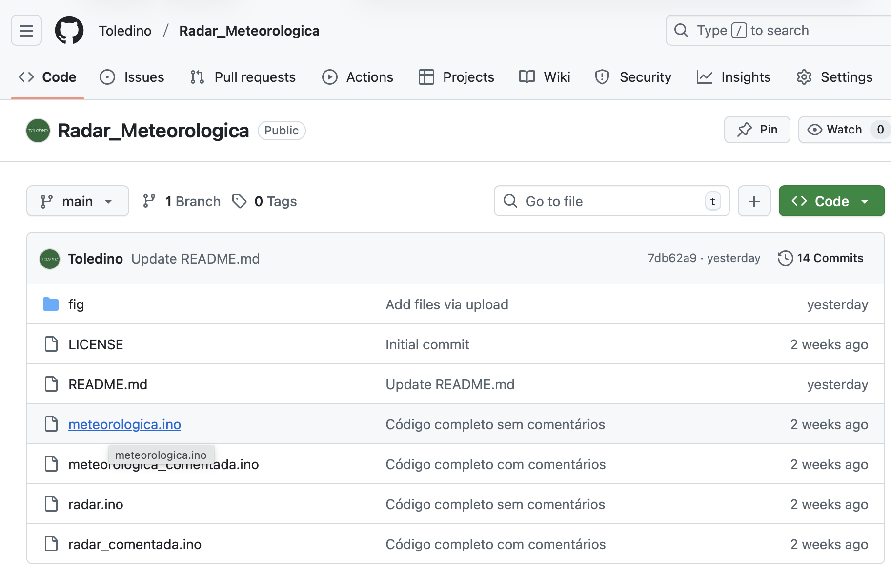

# Radar_Meteorologica
Este kit Arduino inclui um Radar Ultrassônico e uma Estação Meteorológica avançada. Ambos exibem dados em um display OLED de 0.96". A estação se destaca por medir a qualidade do ar, alertando até mesmo sobre a presença de ar tóxico. Perfeito para aprender eletrônica com projetos práticos e resultados visuais imediatos

# Estaçao Metereológica
Este kit de estação meteorológica compacta é controlado por um Arduino Nano (versão USB-C), oferecendo uma plataforma moderna e eficiente para o monitoramento ambiental. O sistema integra o sensor DHT-11 para realizar leituras precisas de temperatura e umidade, operando simultaneamente com o sensor de gás MQ-135, responsável por analisar a pureza do ar. Todas as informações são exibidas em tempo real em um display OLED de 0.96 polegadas (bicolor amarelo e azul), que facilita a visualização dos dados. A lógica do projeto classifica a qualidade do ar em quatro níveis distintos — boa, ruim, muito ruim e tóxica — e utiliza um buzzer ativo para emitir alertas sonoros imediatos caso a detecção atinja níveis críticos ou perigosos.

<table>
  <tr>
    <td align="center">
      
       
      <b>Estação Meteorológica</b>
    </td>
    <td align="center">
      
       
      <b>Esquemático Estação Meteorológica</b>
    </td>
  </tr>
</table>

# Radar Ultrassônico

Este kit de radar ultrassônico é uma aplicação sofisticada de monitoramento espacial controlada por um Arduino Nano (conexão USB-C). O sistema utiliza um servomotor SG90 para movimentar o sensor HC-SR04 em um arco de varredura, mapeando o ambiente em tempo real. Os dados são processados e renderizados em um display OLED de 0.96 polegadas (bicolor amarelo/azul), que exibe uma interface gráfica imersiva similar a um radar real: uma seta de varredura gira indicando o ângulo atual, plotando obstáculos na tela que desaparecem gradualmente (efeito de persistência). Para alertas de proximidade, o sistema monitora continuamente a distância e aciona um buzzer ativo automaticamente caso qualquer objeto seja detectado a menos de 20 cm do sensor.

## Destaques do Funcionamento
**Varredura Ativa:** O servo move o sensor (geralmente entre 0° e 180°) para cobrir uma área ampla.

**Visualização Dinâmica:** O display OLED não mostra apenas números; ele desenha o arco e a posição dos objetos (pontos) em relação ao centro.

**Feedback Sonoro:** O alarme de proximidade (< 25cm) adiciona uma camada de segurança ou interatividade ao projeto

<table>
  <tr>
    <td align="center">
      
       
      <b>Radar Ultrassônico</b>
    </td>
    <td align="center">
      
       
      <b>Esquemático Radar Ultrassônico</b>
    </td>
  </tr>
</table>

# Como faz o dowload do codigo 

Baixar um código (também chamado de "repositório") do GitHub é uma tarefa comum e muito simples.

Aqui está o passo a passo:

## Copiar apenas o código principal (Ideal para Arduino)
Se você só precisa do código do Arduino (o arquivo .ino) e não quer baixar o projeto inteiro:
1. **Acesse o Repositório:** Entre no link do GitHub que a pessoa te passou ou no perfil dela (ex: github.com/toledino) e clique na aba Repositories para escolher o projeto, no caso "Radar_Meteorologica".
2. **Abra o Arquivo:** Na lista de arquivos do repositório, clique no nome do arquivo que você quer (geralmente termina em .ino ou .c).
3. **Copie o Conteúdo:**
4. Procure no canto superior direito do código um ícone que parecem **dois quadradinhos sobrepostos** (Copy raw file). Ao clicar nele, o código será copiado para sua área de transferência.
5. Alternativa: Clique no botão escrito **Raw**. O navegador abrirá uma página só com o texto preto no branco. Dê Ctrl+A para selecionar tudo e Ctrl+C para copiar.
6. **Cole:** Abra sua IDE do Arduino e cole o código (Ctrl+V).

   

  

**🤖 Dicas para Pedir Ajuda à IA na Programação Arduino**   

Para aproveitar ao máximo a ajuda de uma IA, como eu, ao analisar seu código Arduino, é fundamental ser **claro e fornecer o máximo de contexto possível.Copie e cole o código completo** que você está utilizando. Em seguida, use comandos específicos para quebrar o código em partes compreensíveis. Por exemplo, você pode começar pedindo: **"Analise o código Arduino abaixo. Explique, linha por linha ou em blocos de função, o que cada parte faz e como ela se relaciona com o objetivo geral do projeto."** Não se esqueça de mencionar o hardware que você está usando (ex: "Estou usando um Arduino Nano com um sensor ultrassônico HC-SR04 e um servo motor SG90"). Isso me ajuda a entender a função das bibliotecas (#include <...> ) e as variáveis que você declarou para os pinos. Se houver alguma função que você não entende completamente, pergunte diretamente sobre ela: **"O que exatamente o comando** digital Write(pin, HIGH); **faz na função** loop() **e por que você o usaria dessa forma?"**

Depois de entender a função de cada parte, você pode avançar para **perguntas mais conceituais** ou de **depuração**. Se o seu código não estiver funcionando, diga-me **o que você esperava que acontecesse** e **o que realmente está acontecendo** (ex: "O LED D13 deveria piscar a cada 500ms, mas ele fica aceso direto"). Isso me permite ir além de uma simples explicação e focar na **lógica do programa** e em **erros de sintaxe ou de hardware**. Além disso, use a IA para **explorar alternativas**. Pergunte: **"Existe uma forma mais eficiente (em termos de memória ou velocidade) de escrever esta parte do código onde leio o sensor?"** Ou, se estiver pronto para o próximo passo, peça sugestões de como **expandir o projeto**: **"Como eu poderia adicionar um display OLED para mostrar os dados lidos pelo sensor neste código?"** Transforme a IA em seu parceiro de depuração e design.

