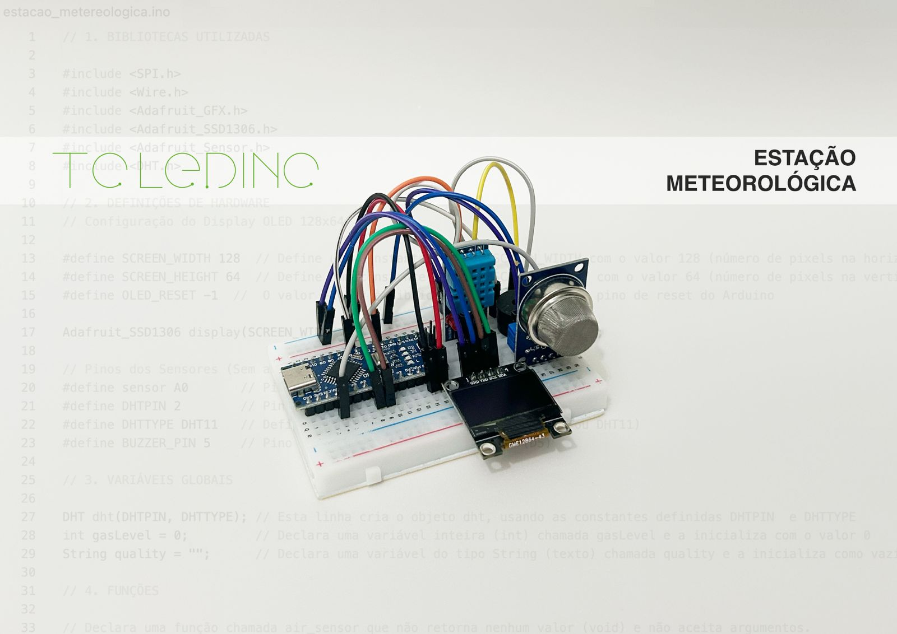
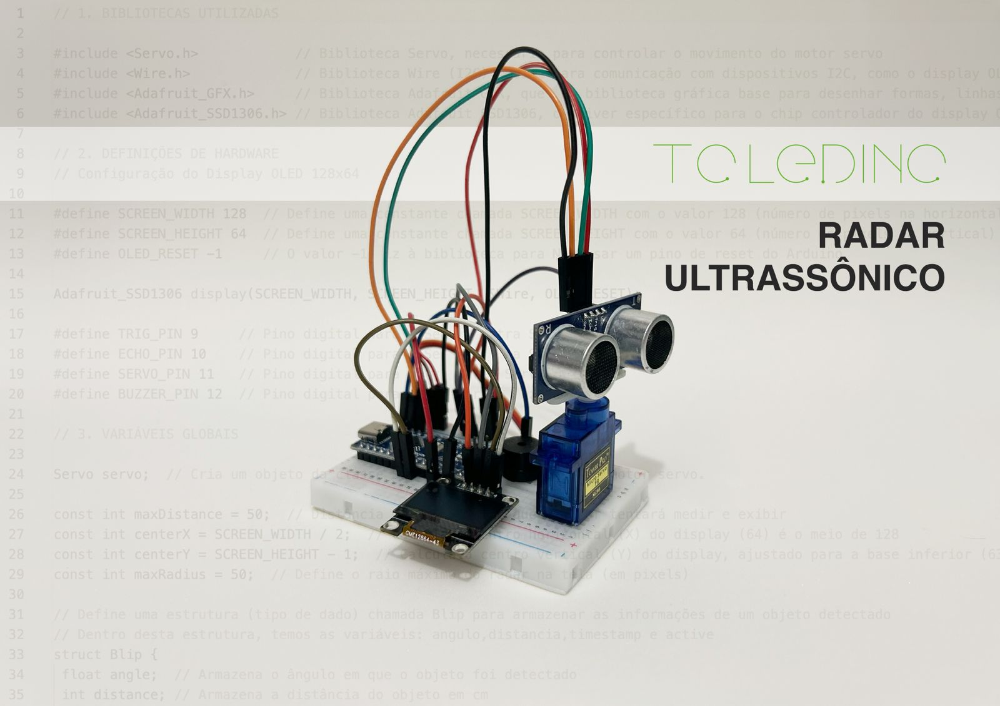
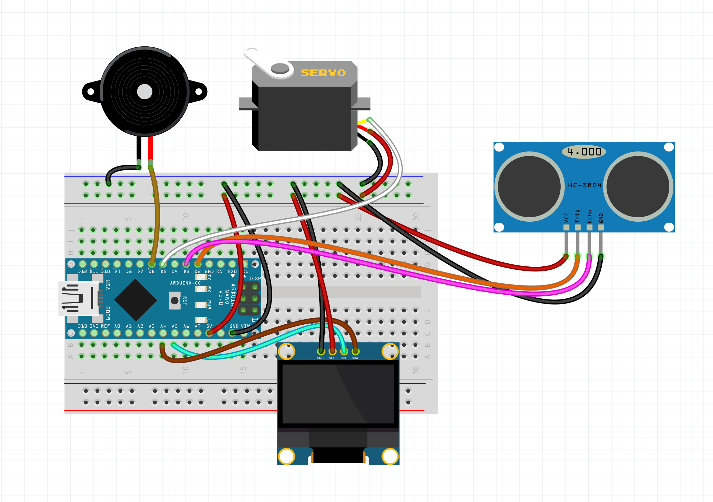

# Radar_Meteorologica
Este kit Arduino inclui um Radar Ultrassônico e uma Estação Meteorológica avançada. Ambos exibem dados em um display OLED de 0.96". A estação se destaca por medir a qualidade do ar, alertando até mesmo sobre a presença de ar tóxico. Perfeito para aprender eletrônica com projetos práticos e resultados visuais imediatos

# Estaçao Metereológica
Este kit de estação meteorológica compacta é controlado por um Arduino Nano (versão USB-C), oferecendo uma plataforma moderna e eficiente para o monitoramento ambiental. O sistema integra o sensor DHT-11 para realizar leituras precisas de temperatura e umidade, operando simultaneamente com o sensor de gás MQ-135, responsável por analisar a pureza do ar. Todas as informações são exibidas em tempo real em um display OLED de 0.96 polegadas (bicolor amarelo e azul), que facilita a visualização dos dados. A lógica do projeto classifica a qualidade do ar em quatro níveis distintos — boa, ruim, muito ruim e tóxica — e utiliza um buzzer ativo para emitir alertas sonoros imediatos caso a detecção atinja níveis críticos ou perigosos.

<table>
  <tr>
    <td align="center">
      
       
      <b>Estação Meteorológica</b>
    </td>
    <td align="center">
      
       
      <b>Esquemático Estação Meteorológica</b>
    </td>
  </tr>
</table>

# Radar Ultrassônico
Este kit de radar ultrassônico é uma aplicação sofisticada de monitoramento espacial controlada por um Arduino Nano (conexão USB-C). O sistema utiliza um servomotor SG90 para movimentar o sensor HC-SR04 em um arco de varredura, mapeando o ambiente em tempo real. Os dados são processados e renderizados em um display OLED de 0.96 polegadas (bicolor amarelo/azul), que exibe uma interface gráfica imersiva similar a um radar real: uma seta de varredura gira indicando o ângulo atual, plotando obstáculos na tela que desaparecem gradualmente (efeito de persistência). Para alertas de proximidade, o sistema monitora continuamente a distância e aciona um buzzer ativo automaticamente caso qualquer objeto seja detectado a menos de 20 cm do sensor.

## Destaques do Funcionamento
Varredura Ativa:O servo move o sensor (geralmente entre 15° e 165°) para cobrir uma área ampla.
Visualização Dinâmica: O display OLED não mostra apenas números; ele desenha o arco e a posição dos objetos (pontos) em relação ao centro.
Feedback Sonoro: O alarme de proximidade (< 20cm) adiciona uma camada de segurança ou interatividade ao projeto

<table>
  <tr>
    <td align="center">
      
       
      <b>Radar Ultrassônico</b>
    </td>
    <td align="center">
      
       
      <b>Esquemático Radar Ultrassônico</b>
    </td>
  </tr>
</table>
